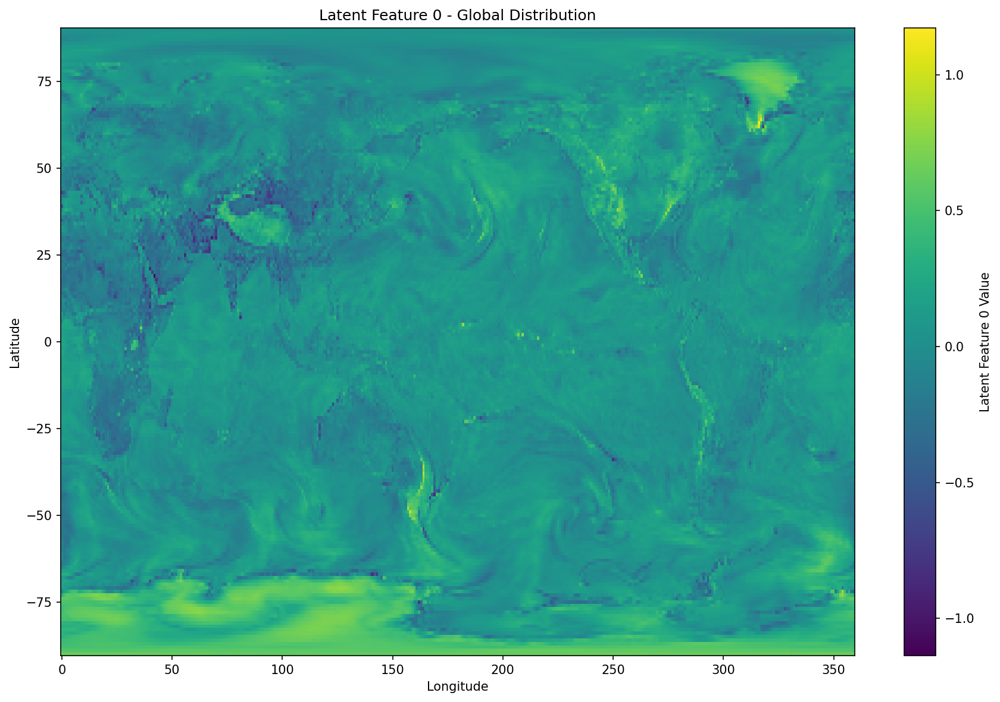
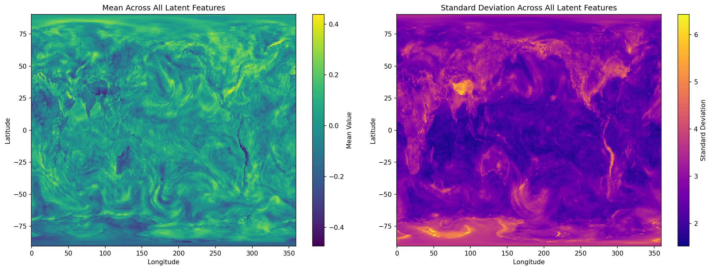

# GraphCast Latent Analysis

A fork of Google DeepMind's GraphCast with enhanced latent data extraction capabilities.

## 🎯 What This Enables

**Latent representations** are the internal "thoughts" of AI weather models. This fork lets you extract and visualize what GenCast models have learned about weather patterns.

## 📊 Visualizations

### Latent Feature Patterns

*Spatial patterns learned by the first latent feature*

### Statistical Analysis

*Distribution and correlation analysis of latent representations*

## 🚀 Quick Start

Extract latent data for any date:

```bash
python gencast_latents.py --date 2022-06-01
```

This generates:
- USA-focused latent data files (`latent_usa_*.nc`)
- Comprehensive statistical analysis
- Spatial pattern visualizations

## 💡 Why This Matters

### For Researchers
- **Understand** what AI models learn about weather
- **Validate** that models capture physically meaningful patterns
- **Compare** different model architectures

### For Practitioners
- **Debug** model behavior and identify biases
- **Build trust** in AI weather predictions
- **Develop** new evaluation metrics

### For Education
- **Visualize** complex AI decision-making
- **Demonstrate** how deep learning "thinks" about weather
- **Bridge** traditional meteorology and AI

## 🔧 What's Different

This fork adds:
- `gencast_latents.py` - Enhanced latent extraction script
- Cloud data integration (WeatherBench2 ERA5)
- USA regional focus for detailed analysis
- Comprehensive statistical analysis
- Flexible date selection (1959-2023)

## 📦 Installation

```bash
pip install -r requirements.txt
# For latent analysis features
pip install gcsfs matplotlib
```

## 📋 License

This is a fork of Google DeepMind's GraphCast. See original licenses in the respective files.

## 🤝 Contributing

This fork focuses on latent data analysis enhancements. Core GraphCast functionality remains unchanged from the original.

---

*Built on Google DeepMind's GraphCast - enhanced for latent data insights*
